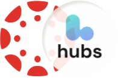

<!-- Improved compatibility of back to top link: See: https://github.com/othneildrew/Best-README-Template/pull/73 -->

<a name="readme-top"></a>

<!--
*** Thanks for checking out the Best-README-Template. If you have a suggestion
*** that would make this better, please fork the repo and create a pull request
*** or simply open an issue with the tag "enhancement".
*** Don't forget to give the project a star!
*** Thanks again! Now go create something AMAZING! :D
-->

<!-- PROJECT SHIELDS -->
<!--
*** I'm using markdown "reference style" links for readability.
*** Reference links are enclosed in brackets [ ] instead of parentheses ( ).
*** See the bottom of this document for the declaration of the reference variables
*** for contributors-url, forks-url, etc. This is an optional, concise syntax you may use.
*** https://www.markdownguide.org/basic-syntax/#reference-style-links
-->

[![Contributors][contributors-shield]][contributors-url]
[![Forks][forks-shield]][forks-url]
[![Stargazers][stars-shield]][stars-url]
[![Issues][issues-shield]][issues-url] [![MIT License][license-shield]][license-url] [![LinkedIn][linkedin-shield]][linkedin-url] <!-- PROJECT LOGO --> <br /> <div align="center"> <a href="https://github.com/LukeMacdonald/IP-302-VRCanvasShell-Mozilla">  </a> <h3 align="center">Canvas Hubs Connector</h3> <p align="center"> As apart of my university capstone project I was assigned the task of integrating the education platform Canvas LMS with Virtual Reality!

The aim of this project was to to offer students a more immersive learning experience by providing educators with the means to conduct classes, lectures, in a VR setting, with the hope that students are further engaged with the material. <br />
<a href="https://github.com/LukeMacdonald/IP-302-VRCanvasShell-Mozilla"><strong>Explore the docs »</strong></a>
<br />
<br />
<a href="https://github.com/LukeMacdonald/IP-302-VRCanvasShell-Mozilla">View Demo</a>

  </p>
</div>

<!-- TABLE OF CONTENTS -->
<details>
  <summary>Table of Contents</summary>
  <ol>
    <li>
      <a href="#about-the-project">About The Project</a>
      <ul>
        <li><a href="#built-with">Built With</a></li>
      </ul>
    </li>
    <li>
      <a href="#getting-started">Getting Started</a>
      <ul>
        <li><a href="#prerequisites">Prerequisites</a></li>
        <li><a href="#installation">Installation</a></li>
      </ul>
    </li>
    <li><a href="#usage">Usage</a></li>
    <li><a href="#roadmap">Roadmap</a></li>
    <li><a href="#contact">Contact</a></li>
    <li><a href="#additional-resources">Additional Resources</a></li>
  </ol>
</details>

<!-- ABOUT THE PROJECT -->

## About The Project

[![Product Name Screen Shot][product-screenshot]](https://example.com)

<p align="right">(<a href="#readme-top">back to top</a>)</p>

### Built With

<div style="column-count: 2; -webkit-column-count: 2 -moz-column-count: 2;">
  
- [![React][React.js]][React-url]
- [![TailwindCSS][TailwindCSS-badge]][TailwindCSS-url]
- [![NodeJS][NodeJS-badge]][NodeJS-url]
- [![Nodemon][Nodemon-badge]][Nodemon-url]
- [![ExpressJS][Express.JS-badge]][ExpressJS-url]
- [![ThreeJS][ThreeJS-badge]][ThreeJS-url]
- [![Trello][Trello-badge]][Trello-url]

- [![JavaScript][JavaScript-badge]][JavaScript-url]
- [![Docker][Docker-badge]][Docker-url]
- [![Kubernetes][Kubernetes-badge]][Kubernetes-url]
- [![GitHubActions][GitHubActions-badge]][GitHubActions-url]

</div>

<p align="right">(<a href="#readme-top">back to top</a>)</p>

<!-- GETTING STARTED -->

## Getting Started

### Prerequisites

1. Before installing and running project you must first have access to your own Mozilla Hubs Client.

   There are multiple options to this.

   1. [Hubs Cloud](https://hubs.mozilla.com/docs/hubs-cloud-custom-clients.html)
   2. [Mozilla Hubs Managed Client](https://hubs.mozilla.com/)
   3. [Hubs Community Edition](https://github.com/mozilla/hubs-cloud/blob/master/community-edition/readme.md) (Fully self managed)

2. Install latest npm
   ```sh
   npm install npm@latest -g
   ```

#### Deploying with Community Edition

This below method is used when deploying Mozilla Hubs Community Edition onto a single node Kubernetes cluster.

1. Install K3s
   ```sh
    curl https://get.k3s.io/ | sh -
   ```
2. Edit `hubs-community/render.sh` to your chosen service configurations.
3. Run the below command inside `hubs-community`
   ```sh
   bash render.sh && sudo k3s kubectl apply -f community.yaml
   ```
4. Expose the external IP address of machine running cluster to DNS
5. Configure firewalls to ensure the following ports are open,
   - TCP: 80, 443, 4443, 5349
   - UDP: 35000 -> 60000
   - Also ensure port for running your SMTP service is open.

##### What to do if SMTP Ports are blocked?

If all SMTP ports are blocked on the machine then setting up ssh port forwarding can be used overcome the blocked.

- NOTE: The ssh connection must remain open to allow forwarding.

1. Add porting forwarding rule to `~/.ssh/config` on your machine which has the SMTP port unblocked.
   ```sh
   Host HOSTNAME
     HostName EXTERNAL_IP
     User YOUR_USER
     IdentityFile IDENITY_KEY
     RemoteForward *:CLUSTER_SMTP_PORT SMTP_SERVER:SMTP_PORT
     ForwardAgent yes
   ```
   - `HOSTNAME` = hostname of machine running cluster
   - `EXTERNAL_IP` = external ip address of machine running cluster
   - `IDENITY_KEY` = location of private key used to allow `YOUR_USER` remote access to machine running cluster.
   - `CLUSTER_SMTP_PORT` = port you specifiy in the `render.sh` e.g. `2587`
   - `SMTP_SERVER` = server endpoint for chosen SMTP service provider
   - `SMTP_PORT` = is the port of the SMTP service provider that was originally blocked, e.g. `587`
2. Start port forwarding
   ```sh
   ssh HOSTNAME
   ```
3. Update the render.sh to reflect port forwarding
   ```sh
   SMTP_SERVER=EXTERNAL_IP
   SMTP_PORT=CLUSTER_SMTP_PORT
   ```
4. Apply changes to k3s cluster

#### Deploying Community Edition with Custom Hubs Client

1. Fork [Hubs Repostiroy](https://github.com/mozilla/hubs)
2. Inside the root directory of your forked hubs repository run

   ```sh
   # Build docker file
   docker build -t hubs -f ./RetPageOriginDockerfile . --platform=linux/armd64

   # Tag and push to your Docker Hub Repo
   docker tag hubs DOCKER_HUB_USER/REPO:latest
   docker push DOCKER_HUB_USER/REPO:latest
   ```

3. Update `render.sh`
   ```sh
   HUBS_IMG=DOCKER_HUB_USER/REPO
   ```
4. Apply changes to k3s cluster

### Installation

1. Get an API Key at https://CUSTOM-HUBS-CLIENT/token (requires admin access) - token will need both read and write room permissions.
2. Clone the repo
   ```sh
   git clone https://github.com/LukeMacdonald/IP-302-VRCanvasShell-Mozilla.git
   ```
3. Install NPM packages
   ```sh
   cd client
   npm install
   cd ../server
   npm install
   ```
4. Create .env in `server`
   ```sh
   cd server
   touch .env
   ```
5. Enter API KEY and PORT to run server on in `server/.env`
   ```sh
   HUBS_API_KEY=YOUR_KEY
   PORT=YOUR_PORT # default is 3000
   ```
6. Update Hubs URL at `server/config/config.js`
   ```js
   exports.HUBS_PUBLIC_URL = "https://CUSTOM-HUBS-CLIENT";
   ```
7. (Optional) If working outside of RMIT canvas domain update the canvas url inside `server/config/config.js`
   ```js
   exports.CANVAS_BASE_URL = "https://YOUR-CANVAS-DOMAIN/api/v1/";
   ```
8. Updating frontend environment variables.

   1. (Development) If not using port 3000 then you must update `REACT_APP_API_URL` in `client/.env.development`
      ```sh
       REACT_APP_API_URL=http//:localhost:YOUR_PORT
      ```
   2. (Production) When deploying your own version you must update `REACT_APP_API_URL` in `client/.env.production` to the url of your deployed server.
      ```sh
      REACT_APP_API_URL=YOUR_SERVER
      ```

<p align="right">(<a href="#readme-top">back to top</a>)</p>

<!-- USAGE EXAMPLES -->

## Usage

#### Obtaining Credientals to Create Account.

To be able to use the functionality of this web application the user must ensure they are assigned as a teacher to the course's they wish to create Mozilla Hubs rooms for.

##### Create API KEY for Canvas

>

To enable our application to interact with Canvas on your behalf, you need to generate an access token with necessary permissions.

1. Log into your Canvas account and navigate to the API settings.
2. Create a new access token with the required permissions to allow seamless integration with our application.

##### Use API Key to Create Account


1. Visit [Signup](`https://staff.canvas-hub.com/signup`) or if you are running your own custom version `https://CUSTOM-URL/signup`
2. Use the generated access token to create your account, ensuring a secure and seamless connection.
3. Fill out the required information and complete the registration process.

####

<p align="right">(<a href="#readme-top">back to top</a>)</p>

<!-- ROADMAP -->

## Roadmap

- [x] Account Creation
  - [x] Link Account to Canvas
  - [x] Enforce username/email validation to ensure they match to their canvas account
- [x] Generation of Mozilla Hubs Rooms through API
- [x] Loading files from Canvas Course
  - [x] Filtering files based on course module
- [x] Upload canvas file to Mozilla Hubs Room

  - [x] Create mechanism to select coordinate, scaling and rotation of object in room.
  - [x] Allow for multiple objects to be uploaded to a room at once.
  - [x] Develop method to create bots to upload selected objects to hubs rooms.
  - [x] Add database to store room configurations to allow for easy reloading.

- [x] Editting already created rooms

  - [x] Create function to use bots to obtain all the relevant information about the current objects in a room.
  - [x] Override the old room configuration with the data obtained by bots.
  - [x] Create a trigger which causes this in room modification

- [ ] Run Canvas quizzes through hubs room

  - [x] Develop interactive 3D menu for multiple choice quiz on custom hubs client
  - [x] Create function to pull quiz questions from canvas and display them on hubs quiz component
  - [ ] Implement mechanism for students to answer quiz questions and make submission through hubs.

- [ ] Deploy own hubs client using community edition

<p align="right">(<a href="#readme-top">back to top</a>)</p>

<!-- CONTRIBUTING -->

## Additional Resources

- https://github.com/LukeMacdonald/hubs -- My forked hubs repository
- https://staff.canvas-hub.com -- Current deployed version of canvas hubs connector
- https://test.canvas-hub.com -- Deployed Mozilla Hubs Community Edition
  <!-- MARKDOWN LINKS & IMAGES -->
  <!-- https://www.markdownguide.org/basic-syntax/#reference-style-links -->
  <p align="right">(<a href="#readme-top">back to top</a>)</p>

[contributors-shield]: https://img.shields.io/github/contributors/LukeMacdonald/IP-302-VRCanvasShell-Mozilla.svg?style=for-the-badge
[contributors-url]: https://github.com/LukeMacdonald/IP-302-VRCanvasShell-Mozilla/graphs/contributors
[forks-shield]: https://img.shields.io/github/forks/LukeMacdonald/IP-302-VRCanvasShell-Mozilla.svg?style=for-the-badge
[forks-url]: https://github.com/LukeMacdonald/IP-302-VRCanvasShell-Mozilla/network/members
[stars-shield]: https://img.shields.io/github/stars/LukeMacdonald/IP-302-VRCanvasShell-Mozilla.svg?style=for-the-badge
[stars-url]: https://github.com/LukeMacdonald/IP-302-VRCanvasShell-Mozilla/stargazers
[issues-shield]: https://img.shields.io/github/issues/LukeMacdonald/IP-302-VRCanvasShell-Mozilla.svg?style=for-the-badge
[issues-url]: https://github.com/LukeMacdonald/IP-302-VRCanvasShell-Mozilla/issues
[license-shield]: https://img.shields.io/github/license/LukeMacdonald/IP-302-VRCanvasShell-Mozilla.svg?style=for-the-badge
[license-url]: https://github.com/LukeMacdonald/IP-302-VRCanvasShell-Mozilla/blob/master/LICENSE.txt
[linkedin-shield]: https://img.shields.io/badge/-LinkedIn-black.svg?style=for-the-badge&logo=linkedin&colorB=555
[linkedin-url]: https://linkedin.com/in/luke-macdonald-292a4a208
[product-screenshot]: images/screenshot.png
[JavaScript-badge]: https://img.shields.io/badge/javascript-%23323330.svg?style=for-the-badge&logo=javascript&logoColor=%23F7DF1E
[JavaScript-url]: https://developer.mozilla.org/en-US/docs/Web/JavaScript
[Docker-badge]: https://img.shields.io/badge/docker-%230db7ed.svg?style=for-the-badge&logo=docker&logoColor=white
[Docker-url]: https://www.docker.com/
[Trello-badge]: https://img.shields.io/badge/Trello-%23026AA7.svg?style=for-the-badge&logo=Trello&logoColor=white
[Trello-url]: https://trello.com/
[Kubernetes-badge]: https://img.shields.io/badge/kubernetes-%23326ce5.svg?style=for-the-badge&logo=kubernetes&logoColor=white
[Kubernetes-url]: https://kubernetes.io/
[TailwindCSS-badge]: https://img.shields.io/badge/tailwindcss-%2338B2AC.svg?style=for-the-badge&logo=tailwind-css&logoColor=white
[TailwindCSS-url]: https://tailwindcss.com/
[React.js]: https://img.shields.io/badge/React-20232A?style=for-the-badge&logo=react&logoColor=61DAFB
[React-url]: https://reactjs.org/
[NodeJS-badge]: https://img.shields.io/badge/node.js-6DA55F?style=for-the-badge&logo=node.js&logoColor=white
[NodeJS-url]: https://nodejs.org/en
[Nodemon-badge]: https://img.shields.io/badge/NODEMON-%23323330.svg?style=for-the-badge&logo=nodemon&logoColor=%BBDEAD
[Nodemon-url]: https://nodemon.io/
[Express.js-badge]: https://img.shields.io/badge/express.js-%23404d59.svg?style=for-the-badge&logo=express&logoColor=%2361DAFB
[ExpressJS-url]: https://expressjs.com/
[MySQL-badge]: https://img.shields.io/badge/mysql-%2300f.svg?style=for-the-badge&logo=mysql&logoColor=white
[MySQL-url]: https://www.mysql.com/
[GitHubActions-badge]: https://img.shields.io/badge/github%20actions-%232671E5.svg?style=for-the-badge&logo=githubactions&logoColor=white
[GithubActions-url]: https://github.com/features/actions
[Threejs-badge]: https://img.shields.io/badge/threejs-black?style=for-the-badge&logo=three.js&logoColor=white
[ThreeJS-url]: https://threejs.org/
